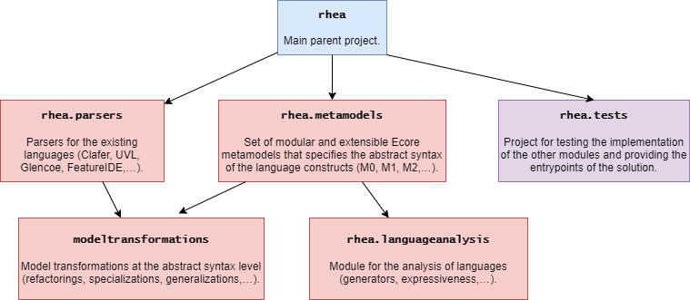

# Generación de modelos de variabilidad con diferente expresividad mediante transformación de modelos - Proyecto Rhea

## Requisitos
- [Java JDK 11+](https://www.oracle.com/java/)
- [Git](https://git-scm.com/)
- [Eclipse for Java & DSL](https://www.eclipse.org/):
  - [Henshin](https://www.eclipse.org/henshin/) (Nightly builds)
  - Ecore Tools (from the Marketplace)

## Estructura del proyecto
La estructura del proyecto queda representada en la siguiente imagen: ([editable source](https://drive.google.com/file/d/1Jscos-3TLRxldxyu5WjWGeU_5kA-QjNi/view?usp=sharing)).

### rhea
El proyecto principal. Es donde se encuentran ubicadas las rutas relativas y absolutas de ficheros, carpetas, modelos etc.

### rhea.evaluation
El proyecto contenedor de las pruebas y los ficheros que usan las transformaciones. Es donde debemos acudir para probarlas y generar los datos de los modelos (más en detalle, en la siguiente sección).

### rhea.interface
Aun no disponible, en un futuro contenedora de la aplicación web así como una API.

### rhea.metamodels
El proyecto que contiene todos los metamodelos de la sintaxsis abstracta necesarios para el funcionamiento de la aplicación, así como las clases generadas a partir de los mismos.

### rhea.transformations
