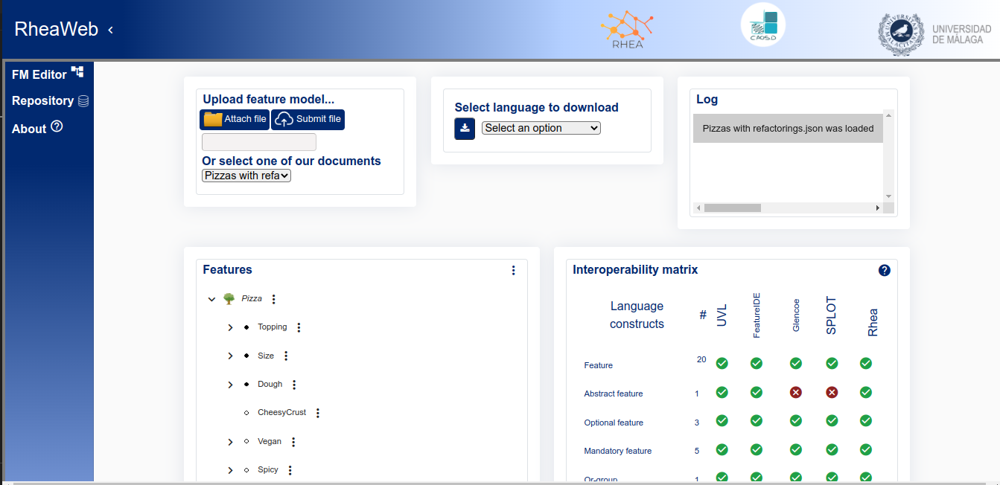

# Rhea 
  - [Description](#description)
  - [Requirements and Installation](#requirements-and-installation)
    - [Initialize the front-server](#initialize-the-backend-server)
    - [Initialize the backend-server](#initialize-the-backend-server)
  - [Automatization](#automatizacion)


## Description

Rhea is a web page that allow the user to create, edit, and download diferent feature models from many diferents file format and that makes them able to be use for many others to, while you can check the parameters of the model and the prepositional constraints of the model.

<p align="center">
  
</p>

## Requirements and Installation
- Python 3.10
To check if it is available.
```
sudo python3 -V
```
If it is not then.
```
sudo apt update && sudo apt upgrade
sudo apt install python3.10
```
- Install/update npm service
```
npm install
```

- Download proyect 
```
git clone https://github.com/CAOSD-group/rhea.git
```
- Create an enviroment


```
python3 -m venv env
source env/bin/activate
```
If everthing goes right, you should see (env) at the beginning of the command line.

- Other packages
this should install all other requirements.
```
pip install -r requirements.txt
```

## Initialize the backend-server
We enter in the folder while having (env) activete.
```
cd rhea-backend
```
To activate the server just run.
```
python server.py
```
To exit.
```
Control+c 
```
## Initialize the front-server
We enter will need a diferent command console for having the two servers.
Get to the folder of the proyect .
```
cd rhea-web
ng serve
```
To exit.
```
Control+c 
```

## Automatization
- From any of the command console we go to teh configuarion and create two services.
```
cd /
sudo nano startweb.service
```
At this moment it should ask for a password.
Onces in the services, copy and paste the current text.
```
[Unit] Description=My custom startup script

[Service] ExecStart=/FOLDER_OF_PROYECT_WITH_FULL_PATH/startWebApp.bash start

[Install] WantedBy=multi-user.target
```
Where the foler direction would depend on where you download the project.
- Repet for the backend

```
cd /
sudo nano startserver.service
```
```
[Unit] Description=My custom startup script

[Service] ExecStart=/FOLDER_OF_PROYECT_WITH_FULL_PATH/startServerApp.bash start

[Install] WantedBy=multi-user.target
```
- To check that everything works,first close both the front-end and the back-end server if they where still running.
```
systemctl start startserver
systemctl status startserver
systemctl start startweb
systemctl status startweb
```
If we go then to localhost:4200 in any browser we will see the web ready to be use.

- To automate the proces.
```
systemctl enable startserver
systemctl enable startweb
```
- To stop the proces at any given moment.

```
systemctl stop startserver
systemctl stop startweb
```
- To stop the proces to start automaticly.
```
systemctl disable startserver
systemctl disable startweb
```

## In progres
We are yet developing the tool to incorporate new tools and features to work with the models.
As examples we are progressing with:
- Numerical Features
- A Repository of models
- New lengages constructs.